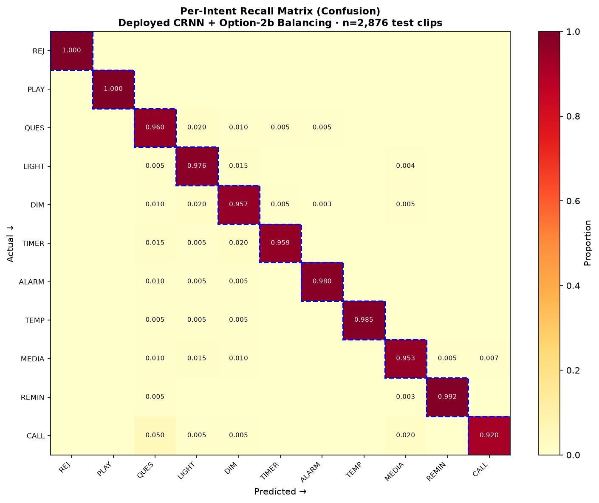

# ME2 — Voice Controlled Smart Device (VCM)

**Course:** AI231 · MLOps Exercises  
**Author:** Alyanna Lopez  
**Date:** October 2026  
**Target:** Raspberry Pi 4/5 — fully on-device, no cloud, no LLM

## Overview

A tiny **Voice Command Model (VCM)** that maps spoken smart-home utterances to one of
**10 command intents** (plus a rejection class) using a **CRNN** (1-D CNN + BiLSTM)
consuming a 101×80 log-mel spectrogram. Exported to **INT8 ONNX (339 KB)**, running at
**~2.7 ms median inference** — comfortably real-time on RPi4/5.

**Headline result:** **97.32% test accuracy** (Cohen's κ = 0.970) on a held-out 2,876-clip
benchmark. Best of 5 benchmarked architectures. Zero false triggers, zero missed commands.

## Repository Structure

```
ME2/
├── README.md                  ← this file
├── labels.csv                 ← 10-intent taxonomy + example utterances
├── code/
│   ├── scripts/               ← training, ETL, benchmarking, evaluation scripts
│   │   ├── etl.py             ← data preprocessing pipeline
│   │   ├── make_splits.py     ← speaker-disjoint balanced splits
│   │   ├── train.py           ← baseline training (5 architectures)
│   │   ├── train_balanced.py  ← Option-2b balanced training (deployed model)
│   │   ├── benchmark_models.py← 5-arch comparison
│   │   ├── eval_comprehensive.py ← full metric battery
│   │   ├── export_and_bench.py ← ONNX export + INT8 quantization
│   │   ├── vcm_infer.py       ← inference engine
│   │   └── ...
│   └── pi_bundle/             ← deployable bundle for Raspberry Pi
│       ├── model_int8.onnx    ← 339 KB INT8 model
│       ├── model_float.onnx   ← 1.3 MB FP32 model
│       ├── vcm_infer.py       ← inference loop
│       ├── live_demo.py       ← real-time mic demo (wake word + VCM)
│       ├── wakeword.py        ← openWakeWord integration
│       ├── mac_handler.py     ← macOS-specific handlers
│       ├── features.py        ← log-mel feature extraction
│       ├── SETUP_GUIDE.md     ← beginner-friendly Pi setup
│       └── NUMBERS_GUIDE.md   ← slot-filling guide
├── models/                    ← exported ONNX + PyTorch checkpoints (4 archs)
├── models_retrain/            ← retrained checkpoints + histories + summary
├── models_v3/                 ← v3 evaluation results
├── report/
│   ├── VCM_Final_Report.md    ← full technical report (403 lines)
│   ├── VCM_Executive_OnePager.md
│   ├── VCM_Model_Evaluation_Report.xlsx
│   └── plots/                 ← all figures (14 PNGs)
│       ├── architecture_diagram.png
│       ├── class_labels.png
│       ├── bench_accuracy.png
│       ├── bench_params_acc.png
│       ├── bench_per_intent.png
│       ├── bench_training_curves.png
│       ├── training_curves_5models.png
│       ├── per_intent_recall_matrix.png
│       ├── best_per_intent.png
│       ├── best_confusion.png
│       ├── best_calibration.png
│       ├── best_robustness.png
│       ├── best_task_completion.png
│       └── best_training_curves.png
├── schema_value_test.json     ← end-to-end slot value test results
├── schema_value_test.py       ← slot value test script
├── validation_full.json       ← full-set validation (2,883 clips)
└── validate_full.py           ← full-set validation script
```

## Quick Start (Raspberry Pi)

See [`code/pi_bundle/SETUP_GUIDE.md`](code/pi_bundle/SETUP_GUIDE.md) for the full
beginner-friendly walkthrough. In short:

1. Flash SD card with Raspberry Pi OS (64-bit)
2. Copy `code/pi_bundle/` to the Pi
3. `pip install onnxruntime openwakeword numpy scipy`
4. `python3 live_demo.py` — speak commands, watch them execute

## Key Results

| Metric | Value |
|--------|------:|
| Test accuracy | **97.32%** |
| Cohen's κ | 0.9701 |
| Macro F1 | 0.9750 |
| Reject accuracy | 100% |
| False triggers | 0 |
| Missed commands | 0 |
| INT8 model size | 339 KB |
| Median inference | 2.7 ms |
| Parameters | 331,691 |

## Architecture Benchmark (5 models)

| Architecture | Params | Test Acc |
|-------------|-------:|---------:|
| Logistic regression | 451 | 47.4% |
| Small DNN | 14,603 | 55.0% |
| 1-D CNN | 246,443 | 95.56% |
| CRNN | 331,691 | 96.35% |
| **CRNN + Option-2b** ★ | 331,691 | **97.32%** |

## Figures




## Dataset

Multi-source corpus (141,681 clips total):
- Google Speech Commands (78,133)
- SLURP (40,247)
- **Option B / MEX2 — Mark Andrian (18,375)** — slotted full-sentence commands
- FLEURS (3,266)
- Snips (1,660)
- Synthetic reject (1,500)

Speaker-disjoint split: 13,578 train / 2,859 val / 2,876 test.

## Reproducibility

All training, evaluation, and export scripts are in `code/scripts/`. The exact
hyperparameters, data splits, and random seeds are documented in
[`report/VCM_Final_Report.md`](report/VCM_Final_Report.md) §5 and §9.
