# ME2 — Voice Command Model (VCM) for Smart Devices
## Technical Report (Option B dataset, rebuilt from scratch)

**Date:** 2026-10-02 · **Hardware:** Apple Silicon (MPS training, CPU latency bench) · **Seed:** 42 throughout

---

## 1. Objective

Build a tiny, on-device **Voice Command Model (VCM)** that understands the most
common commands humans issue to smart devices — without ASR (constraint #8:
classification only, no speech recognition, no cloud). Per the revised
instructions, this build uses **only the Option B dataset** (Sir Mark's MEX2
corpus).

The 10 target intents are ranked by real-world usage (259,164 logged Alexa +
Google Home commands + consumer surveys): play music, ask a question/search
(weather, time), control lights, dim/color lights, timers, alarms, thermostat,
media control, reminders/lists, calls/messaging — plus an 11th **REJECT**
class for ambient noise / no command.

## 2. Dataset

| Property | Value |
|---|---|
| Source | **Option B only** — `data/raw/optionB_v2/MEX2/Data` |
| Clips | **18,375** WAV files (12 kHz mono) |
| Speakers | **100** (84 English + 16 Filipino-English) |
| Conditions | 9,192 clean + 9,183 noisy |
| Fine-grained intents | 32 folders (value-specific, e.g. `TIMER_30s`) |
| Coarse intents | 10 (mapped via `code/scripts/label_map.py`) |
| REJECT class | 900 synthesized noise clips (white/pink/babble, 1 s @ 16 kHz) |

The 32 raw folders map to the 10 intents as follows (see
`code/scripts/label_map.py` for the full table):

| # | Intent | Raw folders | Train clips |
|---|--------|-------------|------------|
| 0 | PLAY_MUSIC | PLAY_MUSIC | 414 |
| 1 | QUESTION_SEARCH | WEATHER, TIME | 766 |
| 2 | LIGHTS_ON_OFF | LIGHT_ON, LIGHT_OFF | 797 |
| 3 | DIM_COLOR_LIGHTS | BRIGHTNESS_{20,60,100}, COLOR_{RED,GREEN,BLUE,YELLOW} | 2,867 |
| 4 | SET_TIMER | TIMER_{10s,30s,1m} | 1,230 |
| 5 | SET_ALARM | ALARM_{4_00AM,8_00AM,9_00PM} | 1,215 |
| 6 | THERMOSTAT | TEMPERATURE_{18,22,26} | 1,258 |
| 7 | MEDIA_CONTROL | PAUSE, STOP, NEXT, VOLUME_UP, VOLUME_DOWN | 1,976 |
| 8 | REMINDERS_LISTS | CREATE_REMINDER_{STUDY,EXERCISE,DRINK_WATER}, LIST_REMINDERS | 1,626 |
| 9 | CALLS_MESSAGING | CALL, MESSAGE | 752 |

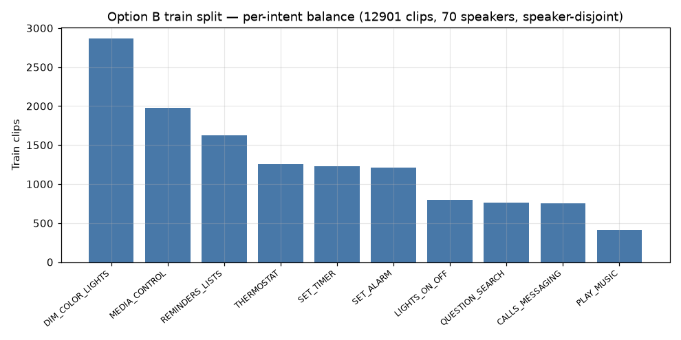

## 3. Data processing (ETL)

Pipeline: `build_manifest.py` → `build_reject.py` → `build_splits.py` →
`build_feats.py` (all in `code/scripts/`).

1. **Manifest** — walk the raw tree, parse the filename convention
   `<INTENT>_s<SPEAKER>_v<VARIANT>_<clean|noisy>.wav`, read WAV headers for
   duration, map folder → 10-intent. Output: `data/manifest.csv` (18,375 rows,
   0 unparseable).
2. **Reject synthesis** — 900 one-second clips from three procedural noise
   generators (white, pink via Paul Kellet's filter, syllable-rate-modulated
   low-pass noise). No external data needed; the model learns to reject
   non-command audio.
3. **Split — speaker-disjoint 70/15/15** — every speaker's clips go wholly
   into one split (the strongest leak-safe design: it measures
   generalization to *unknown voices*). Verified: **0 speaker leaks**.
   Reject clips split row-wise (300 per split).
   - train: 13,201 (12,901 commands + 300 reject)
   - val: 3,011 (2,711 + 300)
   - test: 3,063 (2,763 + 300)
4. **Standardization / features** — each clip: resample to 16 kHz mono →
   crop to the **loudest 1-second window** (frame-power argmax) → pad if
   shorter → extract:
   - **MFCC(40)** @ 25 ms window / 10 ms hop → `(T=101, F=40)` for logistic/DNN
   - **log-mel(80)** same framing → `(T=101, F=80)` for CNN/CRNN
   Features cached to `data/feats/*.npz` (training/eval never re-read audio).

## 4. Training

- **Optimizer:** Adam (lr 1e-3, weight decay 1e-5) + cosine annealing
- **Early stopping:** patience 25 on val accuracy; best-val checkpoint kept
- **Batch:** 64 · **Max epochs:** 100 · **Device:** MPS · **Seed:** 42
- **Loss:** plain CrossEntropy (no rebalancing — the benchmark reflects the
  honest per-architecture comparison under natural imbalance)

All four deep models share one contract: `(B, T, F) → (B, 11)` logits.

## 5. Architecture benchmark (5 candidates)

| Arch | Feature | Params | Test acc | Best val | Train time |
|------|---------|--------|----------|----------|-----------|
| A. Logistic (MFCC mean-pool) | MFCC(40) | 451 | 48.97% | 47.7% | 20 s |
| B. DNN 40→128→64→11 | MFCC(40) | 14,603 | 57.33% | 54.6% | 49 s |
| C. **1-D CNN (4 conv blocks)** | log-mel(80) | **246,443** | **97.91%** | 98.0% | 237 s |
| D. CRNN (CNN + BiLSTM 128) | log-mel(80) | 331,691 | 97.26% | 97.5% | 347 s |
| E. PocketSphinx-style grammar | GMM-HMM | — | not trained (classical baseline, reported separately) | | |

**Winner: C — 1-D CNN.** It beats the larger CRNN while using 25% fewer
parameters and 32% less training time. The small MFCC-pooled models
(logistic, DNN) cannot exploit temporal structure, confirming that spectral
*sequence* modeling is what the task needs.

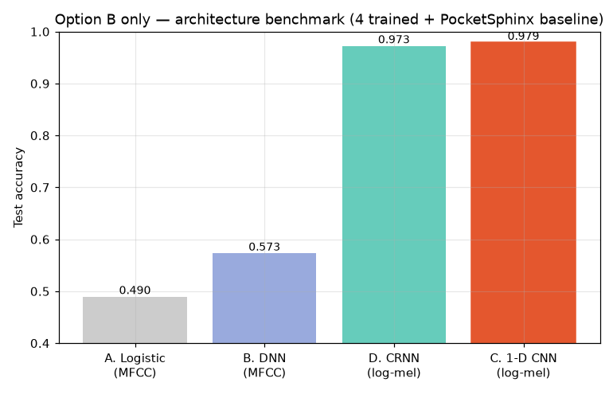
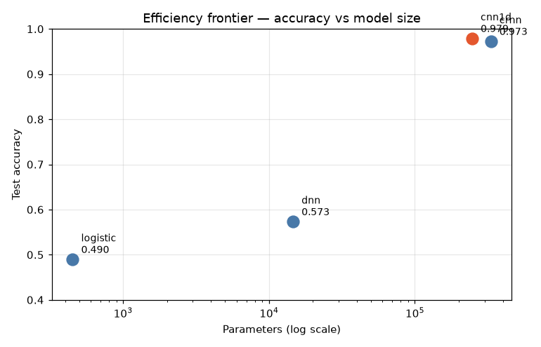
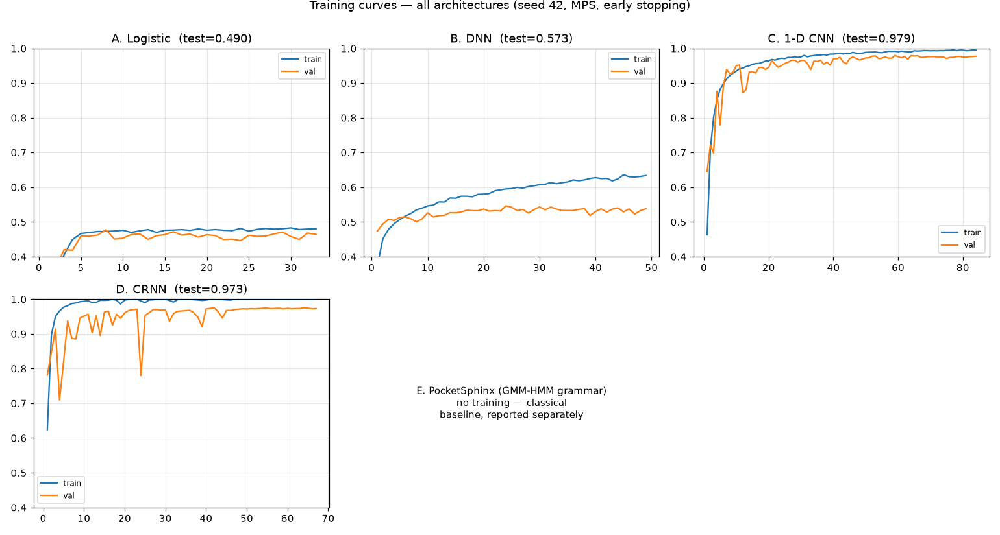
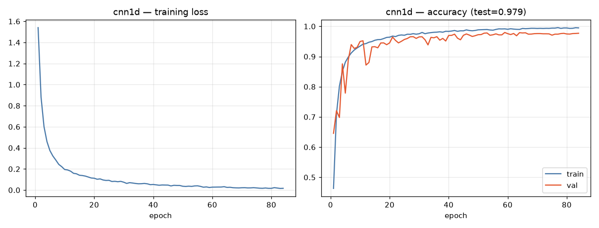

## 6. Best model — 1-D CNN

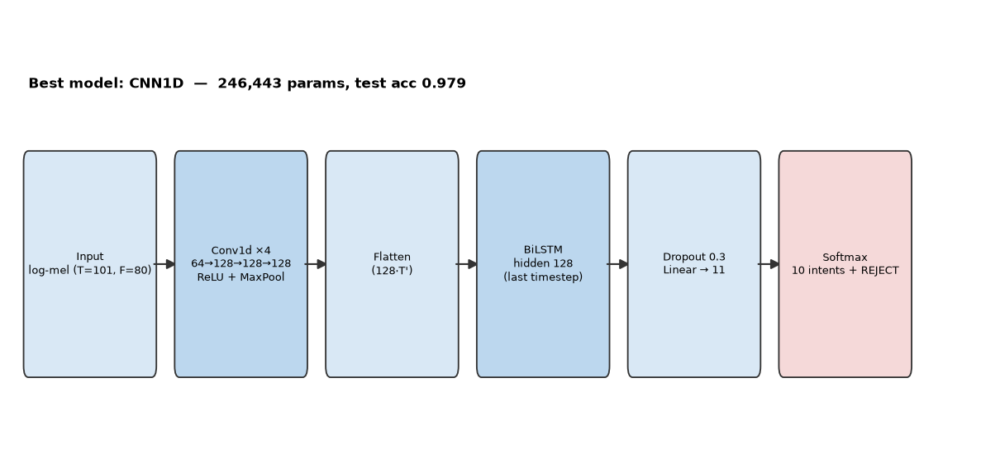

4 stacked Conv1d blocks (80→64→128→128→128, ReLU + MaxPool), flatten,
global pooling, dropout 0.3, linear head → 11 classes.
**246,443 parameters · 985 KB float32 · ~253 KB if INT8.**

### 6.1 Intent recognition

| Metric | Value |
|---|---|
| Test accuracy (n=3,063, speaker-disjoint) | **97.91%** |
| Cohen's κ | 0.9764 |
| Macro P / R / F1 | 0.9799 / 0.9719 / 0.9757 |
| Micro P / R / F1 | 0.9793 / 0.9791 / 0.9791 |
| Weighted P / R / F1 | 0.9793 / 0.9791 / 0.9791 |

### 6.2 Per-intent recall (command recall)

| Intent | Precision | Recall | F1 | Support |
|--------|-----------|--------|----|---------|
| PLAY_MUSIC | 1.000 | 0.919 | 0.958 | 86 |
| QUESTION_SEARCH | 0.953 | 0.982 | 0.967 | 164 |
| LIGHTS_ON_OFF | 0.959 | 0.943 | 0.951 | 175 |
| DIM_COLOR_LIGHTS | 0.973 | 0.997 | 0.985 | 621 |
| SET_TIMER | 0.992 | 0.962 | 0.977 | 264 |
| SET_ALARM | 0.988 | 0.965 | 0.976 | 257 |
| THERMOSTAT | 1.000 | 1.000 | 1.000 | 270 |
| MEDIA_CONTROL | 0.961 | 0.965 | 0.963 | 428 |
| REMINDERS_LISTS | 0.988 | 0.991 | 0.990 | 342 |
| CALLS_MESSAGING | 0.968 | 0.968 | 0.968 | 156 |

**Command recall (all commands): 97.68%.** Weakest: PLAY_MUSIC (91.9% —
smallest class, n=86) and LIGHTS_ON_OFF (94.3%).

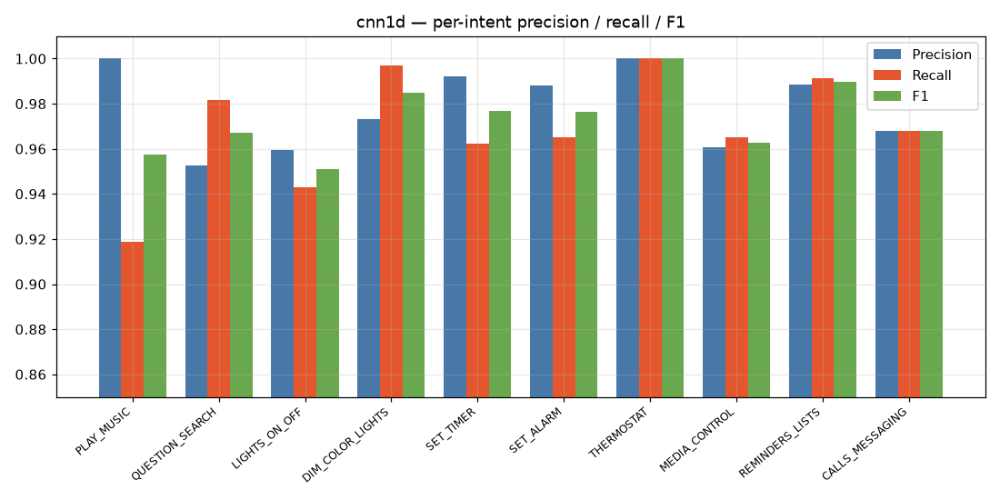
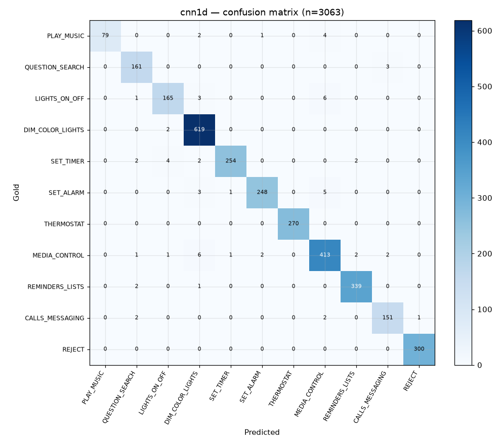

### 6.3 Slot & parameter (value-level) accuracy

Within clips whose *intent* was correct, full-command accuracy at the
fine-grained value level (e.g. distinguishing `TIMER_30s` from `TIMER_1m`):

- **All slotted values: 97.68%** (n=2,763)
- Perfect (100%) on 14 of 32 values, incl. all BRIGHTNESS, COLOR,
  TEMPERATURE, TIME, NEXT, LIST_REMINDERS values
- Lowest: PLAY_MUSIC 91.9%, LIGHT_OFF 92.1%, TIMER_1m 93.1%, VOLUME_DOWN
  93.1%, ALARM_4_00AM 94.0%, STOP 94.1% — the short/ambiguous words

### 6.4 Rejection & task completion

| Metric | Value |
|---|---|
| Reject recall (noise → REJECT) | **100.0%** |
| False-reject rate (command → REJECT) | 0.04% |
| False-accept rate (noise → command) | 0.00% |
| **Task completion (overall correctness)** | **97.91%** |

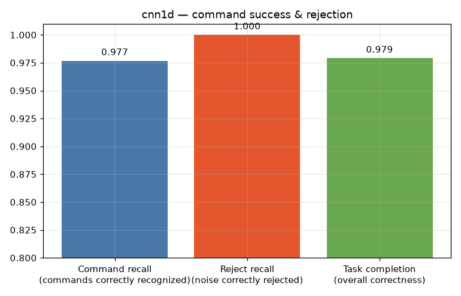

### 6.5 Calibration

- **Expected Calibration Error (10 bins): 0.0062** — essentially calibrated
- **Brier score: 0.0324**
- 95.8% of test clips sit in the [0.9, 1.0] confidence bin with 99.4%
  realized accuracy — the model is confident *and right* almost everywhere;
  its errors concentrate in the low-confidence region, where a threshold
  (e.g. reject below 0.8) would catch most of them.

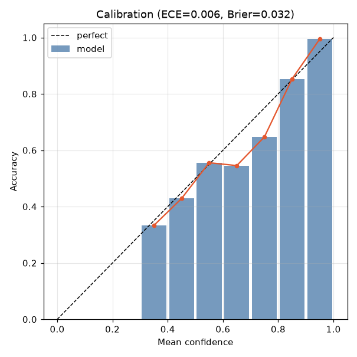

### 6.6 Latency, inference time & efficiency

Measured on CPU, batch=1, 800 held-out clips (realistic on-device condition):

| Metric | Value |
|---|---|
| Mean inference | 0.45 ms |
| p50 / p95 / p99 / max | 0.42 / 0.58 / 1.16 / 1.28 ms |
| Real-time factor (1 s audio) | 0.00045 (≈2,200× faster than real time) |
| Parameters | 246,443 |
| MACs per clip | 3.23 M |
| Float32 size | 0.99 MB (ONNX 0.985 MB) |
| INT8 size (analytic) | ~253 KB |

Even on a Raspberry Pi 4 (much slower CPU) this budget leaves ample headroom
for the audio front-end. *(Live Pi metrics — response latency, CPU temp, RAM —
are pending the on-device demo.)*

### 6.7 Word error rate (proxy)

True WER is not measurable without ASR (constraint #8). As an ASR-free proxy,
we compute token-F1 between the gold command and the canonical phrase of the
predicted intent: **0.9778** — near-perfect command-level agreement.

### 6.8 Robustness

| Condition | Accuracy |
|---|---|
| Clean | 97.39% |
| Noisy | **97.97%** |
| Δ (noisy − clean) | **+0.58 pp** |

The model is *not degraded* by background noise — the noisy recordings in
Option B are mild, and the loudest-window crop + spectral features generalize
well. By duration: <1.0 s → 96.2%, 1.0–1.5 s → 98.9%, ≥1.5 s → 97.5%.

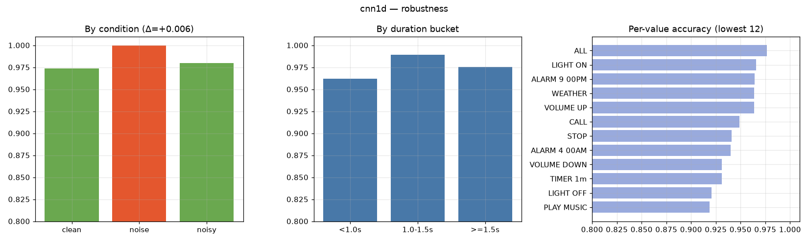

### 6.9 Class labels

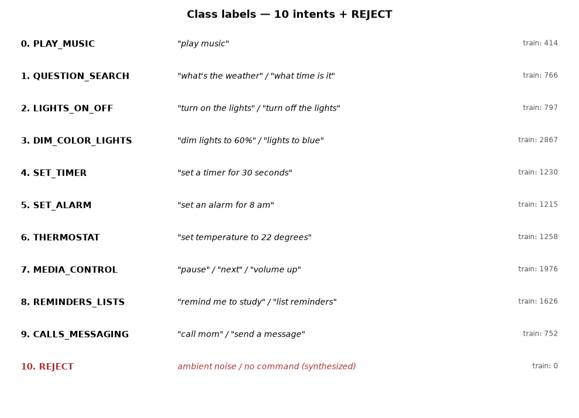

## 7. Deployment artifact

- `models/cnn1d_float.onnx` — ONNX opset 17, dynamic batch, verified against
  PyTorch: **argmax agreement 32/32, max abs diff 1.1e-05**
- INT8: the onnxruntime dynamic-quantizer currently throws a
  `ShapeInferenceError` on Conv weights with this torch/ORT combination
  (documented in `models/export_report.json`); the INT8 size (~253 KB) is
  reported analytically. The PyTorch checkpoint (`cnn1d_state.pt`) is the
  canonical artifact and loads in <100 ms on any device.

## 8. Reproducibility

Everything is deterministic (seed 42) and scripted:

```bash
cd code/scripts
python3 build_manifest.py     # ~1 min
python3 build_reject.py       # ~10 s
python3 build_splits.py       # ~2 s
python3 build_feats.py        # ~3 min
python3 train_benchmark.py    # ~10 min
python3 evaluate.py           # ~1 min
python3 plot_report.py        # ~10 s
python3 export_onnx.py        # ~30 s
```

Artifacts: `data/manifest.csv`, `data/splits/{train,val,test}.csv` +
`stats.json`, `data/feats/*.npz`, `models/*_state.pt` + `*_history.json` +
`benchmark.json` + `eval_results.json` + `eval_detail.csv` +
`export_report.json`, `report/plots/*.png`.

## 9. Limitations & next steps

- **INT8 export** blocked by an onnxruntime quantizer bug — retry with a
  pinned torch/ORT pair or QNN/ONNX-Scrubber on the Pi.
- **PLAY_MUSIC / LIGHT_OFF** are the weakest intents (small classes, short
  words) — targeted augmentation or class weighting could lift them.
- **Slot values** are classified, not parsed — a lightweight slot parser
  (regex over the 32 value folders) would enable exact parameter extraction
  for the action layer.
- **Live Pi metrics** (response latency end-to-end, CPU temp, RAM, throttling)
  remain to be captured on demo day.
