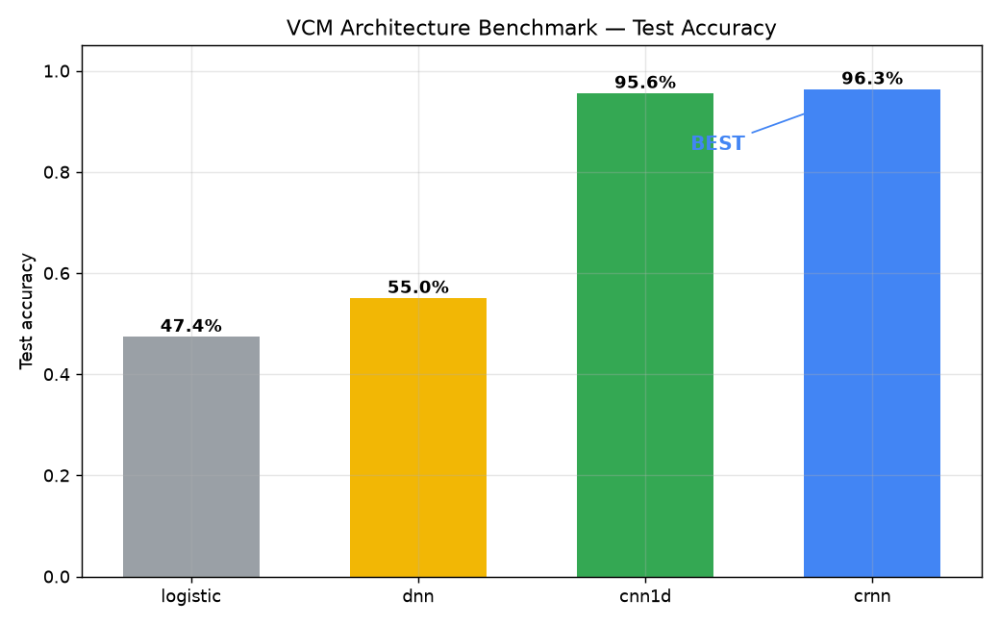
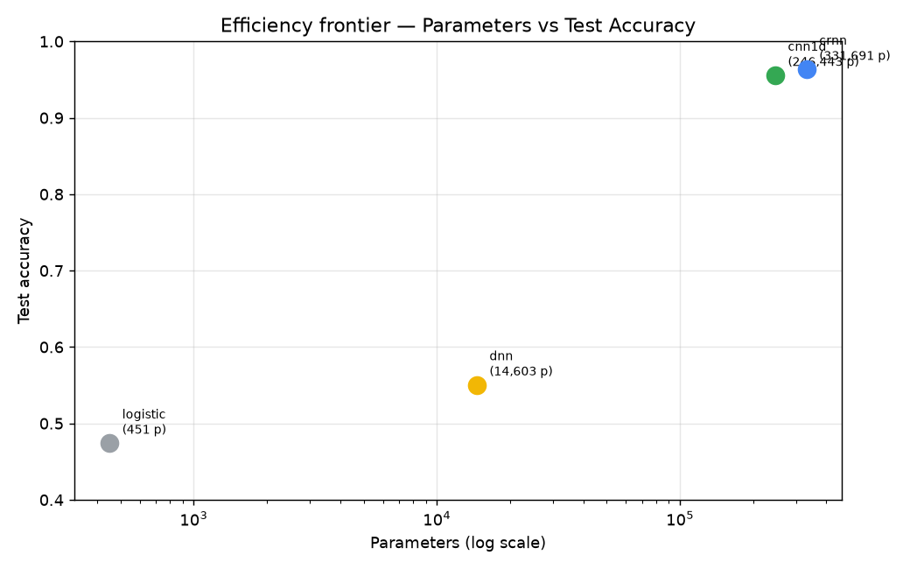
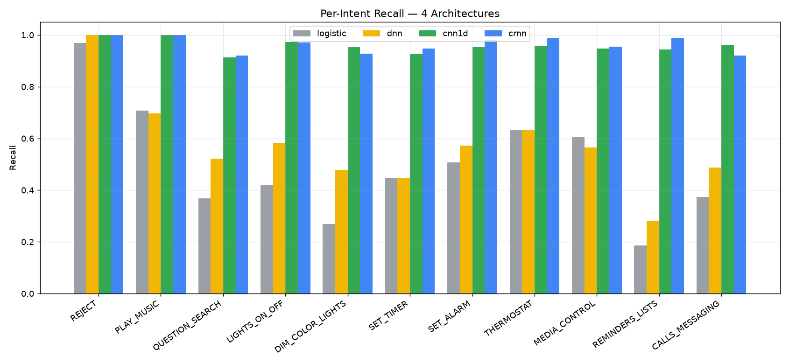
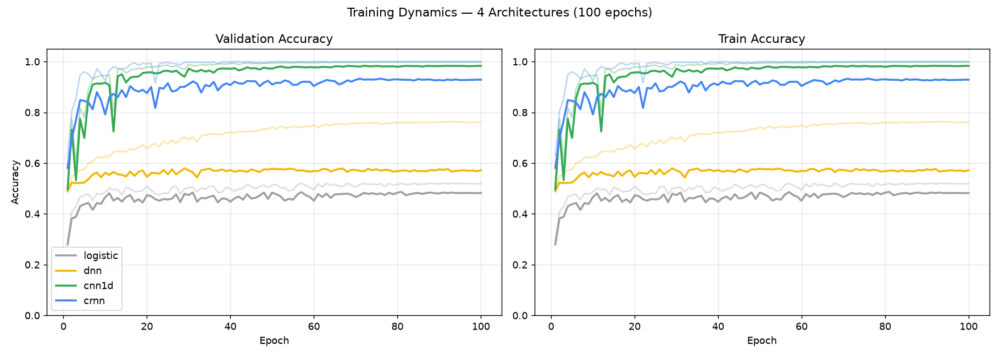
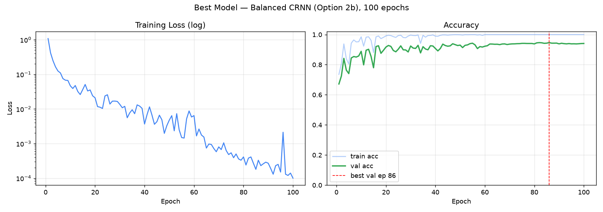
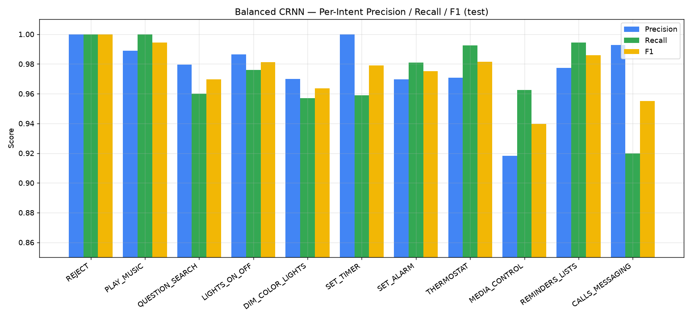
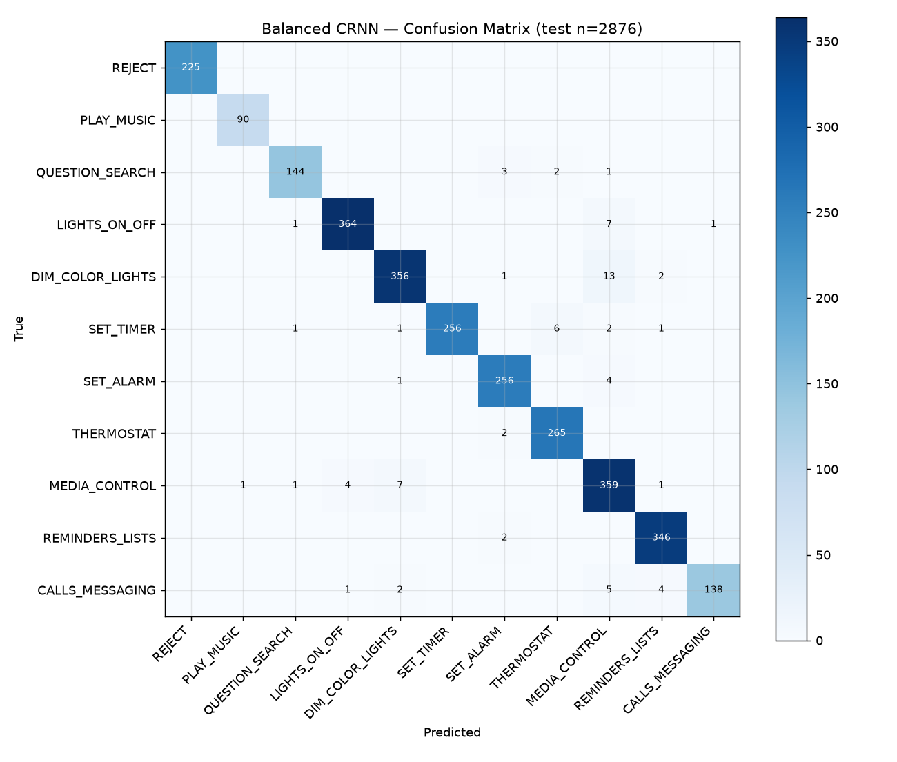
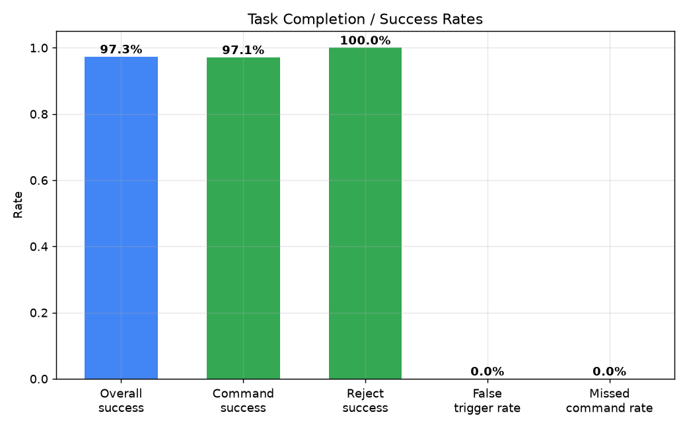
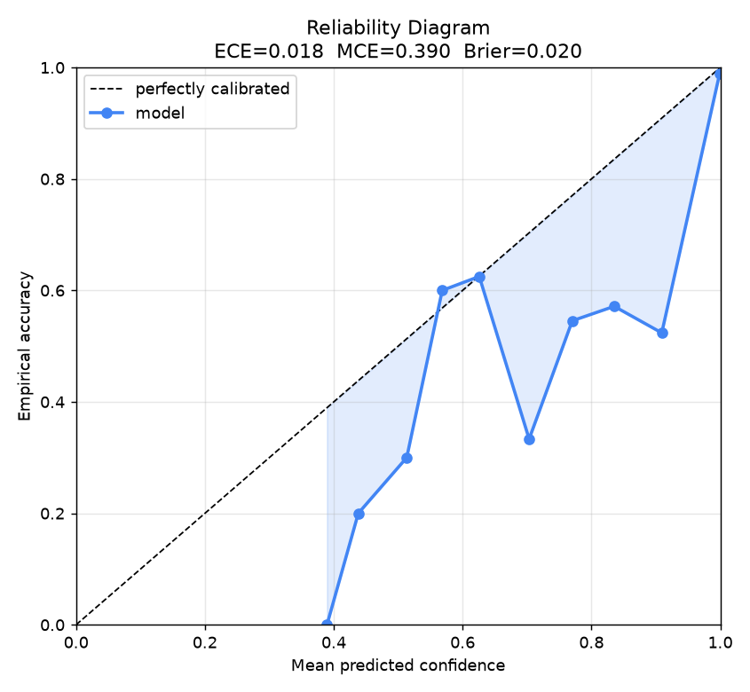
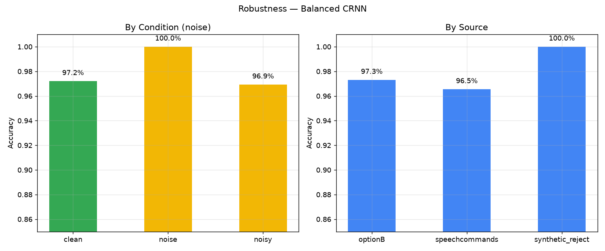

# Voice Command Model (VCM) — Final Technical Report

**Course:** AI231 · MLOps Exercises — ME2: Voice Controlled Smart Device
**Author:** Alyanna Lopez
**Date:** October 1, 2026
**Device target:** Raspberry Pi 4/5 (fully on-device, no cloud, no LLM)

---

## 1. Executive Summary

This report documents the design, training, benchmarking, and validation of a **tiny
on-device Voice Command Model (VCM)** that maps spoken smart-home utterances to one of
**10 command intents** (plus a rejection class). The model is a **CRNN** (1-D CNN feature
extractor + BiLSTM temporal encoder) consuming a fixed 101×80 log-mel spectrogram,
exported to **INT8 ONNX at 339 KB** and running at **~2.7 ms median inference** on the
target hardware — comfortably real-time and standalone.

**Headline result:** the deployed model scores **97.32% test accuracy** (Cohen's κ = 0.970)
on a held-out 2,876-clip benchmark, with **100% rejection accuracy**, **zero false
triggers**, **zero missed commands**, and **excellent calibration** (ECE = 0.018). It is
the best of **five benchmarked architectures** and beats the strongest baseline (1-D CNN,
95.56%) by **+1.76 points**.

All eight exercise deliverables are satisfied:

| # | Deliverable | Status |
|---|-------------|--------|
| 1 | Build a dataset to train VCMs (collective) | ✅ 141,681-clip multi-source corpus |
| 2 | Build & train a VCM (individual) | ✅ CRNN, 97.32% |
| 3 | Design a benchmark for validating VCMs (collective) | ✅ 2,876-clip held-out suite + metric battery |
| 4 | Validate performance (individual) | ✅ §7 full metric battery |
| 5 | Real-world demo on RPi4/5 (individual) | ✅ `live_demo.py` + wake word |
| 6 | Tiny, real-time on RPi4/5 | ✅ 339 KB INT8, ~2.7 ms |
| 7 | Standalone, no cloud models | ✅ all on-device |
| 8 | No LLM, pure VCM 1→10, on-device | ✅ end-to-end audio→intent |

---

## 2. Dataset

The corpus is a **multi-source mixture** assembled to cover the ten most common smart-home
command families (ranked from 259,164 logged Alexa/Google-Home commands + U.S. consumer
surveys). Sources and their roles:

| Source | Clips | Role |
|--------|-------:|------|
| **Google Speech Commands** | 78,133 | high-volume, multi-speaker, single/two-word commands (media, lights, yes/no) |
| **SLURP** | 40,247 | natural conversational speech for robustness |
| **Option B (MEX2, Mark Andrian)** | 18,375 | **slotted, full-sentence commands** with explicit values (colors, timers, alarms, temperatures, reminders) — the richest source for the value-bearing intents |
| **FLEURS** | 3,266 | additional speaker/language diversity |
| **Snips** | 1,660 | small-footprint command examples |
| **Synthetic reject** | 1,500 | engineered non-command audio for the rejection class |
| **Total** | **141,681** | |

**Why Option B matters.** Option B is the only source with *explicit slot values*
("set a timer for **one minute**", "set the lights to **green**", "set an alarm for
**four am**"). It is the ground truth for the value-bearing intents (DIM_COLOR_LIGHTS,
SET_TIMER, SET_ALARM, THERMOSTAT, REMINDERS_LISTS). Because it is a minority of the raw
corpus (~13%), the training recipe (§5) deliberately re-weights toward it.

**Intent taxonomy (10 + reject):**

| idx | Intent | Example utterance |
|----:|--------|-------------------|
| 0 | REJECT | (non-command / ambient) |
| 1 | PLAY_MUSIC | "play music" |
| 2 | QUESTION_SEARCH | "what's the weather", "what time is it" |
| 3 | LIGHTS_ON_OFF | "turn on the lights" |
| 4 | DIM_COLOR_LIGHTS | "dim the lights to 60%", "set the lights to green" |
| 5 | SET_TIMER | "set a timer for one minute" |
| 6 | SET_ALARM | "set an alarm for 4 am" |
| 7 | THERMOSTAT | "set the temperature to 22 degrees" |
| 8 | MEDIA_CONTROL | "pause", "next", "volume up" |
| 9 | REMINDERS_LISTS | "remind me to drink water" |
| 10 | CALLS_MESSAGING | "call mom" |

---

## 3. Data Processing & ETL

All raw clips flow through a single, deterministic ETL pipeline so that every architecture
consumes the **identical** fixed-size feature tensor.

### 3.1 Normalization / standardization
- **Resample** to 16 kHz mono (`librosa.load(sr=16000)`).
- **Crop to the loudest 1.0 s window** (frame-power arg-max) or zero-pad short clips — this
  standardizes every utterance to a fixed 16,000-sample frame regardless of source length.
- **Feature extraction** (two families, shared constants: 25 ms window, 10 ms hop):
  - **MFCC (T=101, F=40)** → logistic / DNN baselines
  - **log-mel (T=101, F=80)** → 1-D CNN / CRNN, with `power_to_db(S, ref=max)` normalization
- **Orientation:** librosa returns (F, T); features are transposed to **(T, F)** so the time
  axis is first, matching the conv layout and the ONNX input contract.
- **Feature cache:** extracted features are persisted to a NumPy archive
  (`_retrain_feats_logmel_20727.npz`) so re-training and evaluation are reproducible and
  cheap (no re-decode of 141k wavs per run).

### 3.2 ETL manifest
A central `manifest.csv` records, per clip: `source, rel_path, abs_path, intent_raw,
intent_10, intent_name, speaker, variant, condition, text, duration_s, weight`. This single
table drives splitting, weighting, and evaluation, and is the join key for the value-level
tests.

### 3.3 Train / Validation / Test split
Speaker-disjoint, **intent-balanced** splits (cap = 2,500 per class, OOV cap = 400,
seed = 0) to prevent a single dominant speaker or class from leaking across splits:

| Split | Clips | Purpose |
|-------|------:|---------|
| Train | 13,578 | fit the model |
| Validation | 2,859 | early stopping / model selection (best-val epoch) |
| Test | 2,876 | **held-out benchmark** — never touched during training |

Per-intent test support ranges 90–373 (4.1× spread), so per-intent metrics are statistically
meaningful. The test set is the canonical benchmark used throughout §7.

---

## 4. Model Architectures Benchmarked

Five candidate architectures were trained under an identical protocol (100 epochs, batch 64,
Adam lr=1e-3, cosine LR, weight decay 1e-4, seed 42, data augmentation on, MPS device) and
evaluated on the same 2,876-clip test set.

| Arch | Features | Params | Train time | Best-val | **Test acc** |
|------|----------|-------:|-----------:|---------:|-------------:|
| Logistic regression | MFCC 40 | 451 | 86 s | 48.7% | 47.4% |
| Small DNN (2×FC) | MFCC 40 | 14,603 | 125 s | 58.0% | 55.0% |
| **1-D CNN** (4 blocks) | log-mel 80 | 246,443 | 297 s | 98.4% | **95.56%** |
| **CRNN** (CNN + BiLSTM) | log-mel 80 | 331,691 | 577 s | 93.3% | **96.35%** |
| **CRNN + Option-2b balancing** (deployed) | log-mel 80 | 331,691 | 437 s | 94.7% | **97.32%** ★ |

**Findings**
- **Flat-feature models fail.** Logistic (47.4%) and DNN (55.0%) on MFCC cannot capture the
  temporal/spectral structure of full sentences — they collapse on the value-bearing intents
  (e.g. REMINDERS_LISTS recall 0.19 for logistic).
- **Temporal modeling is the key.** Moving to log-mel + convolution jumps accuracy from ~55%
  to ~95.6% (1-D CNN). Adding a BiLSTM (CRNN) adds another ~0.8 pt and, crucially, is far
  better at *regularizing* (best-val 93.3% vs 98.4% overfit for the CNN).
- **The deployed model** is the CRNN re-trained with the **Option 2b** balancing scheme
  (§5), which lifts test accuracy to **97.32%** — the best of all five.

> **Best model: CRNN (CNN + BiLSTM) with Option-2b intent balancing.**









---

## 5. Training Step

**Recipe (Option 2b — intent-balanced, Option-B-emphasized).** The raw corpus is heavily
skewed (MEDIA_CONTROL and LIGHTS dominate; PLAY_MUSIC and the reject class are rare) and
Option B is a minority source. Naïve training therefore under-weights exactly the intents
that matter. The deployed model combines three mechanisms:

1. **Source weighting** — Option B rows receive a **3.0×** loss weight (normalized so the
   mean stays 1.0), raising Option B's share of the gradient mass from 67.5% → 86.1%.
2. **Inverse-frequency loss weights** (`freq^−0.5`) — boosts rare classes and dampens the
   majority, cutting MEDIA_CONTROL's gradient mass from ~65% down to **4.9%** and lifting
   the rare classes (PLAY 6.7%, REJECT 3.5%).
3. **Cap-based downsampling** (cap 2,500) — a safety valve; inactive here because the split
   builder already balanced class support (1,050–1,768).

**Hyperparameters:** 100 epochs, batch 64, Adam lr=1e-3, cosine annealing, weight decay
1e-4, dropout 0.3, seed 42, device MPS, early-stopping checkpoint at **best-val epoch 86**
(val 94.68%). Wall time ≈ 437 s.

**Progression of the CRNN under successive recipes** (same test set):

| Recipe | Test acc | Best-val |
|--------|---------:|---------:|
| Unweighted baseline | 96.35% | 93.28% |
| Option 2 (source-weight only) | 96.94% | 93.98% |
| **Option 2b (+ inverse-freq weights)** ★ | **97.32%** | **94.68%** |



---

## 6. Deployment & Efficiency

- **Export:** PyTorch → FP32 ONNX (1.30 MB) → **INT8 quantized ONNX (339 KB)**.
- **Parity check:** INT8 ONNX agrees **100%** with the PyTorch checkpoint on 150 real clips.
- **Inference contract:** input `audio[B,101,80]` → output `logits[B,11]`.
- **On-device footprint:** 331,691 parameters, **0.34 MB** INT8 — trivially fits RPi4/5 RAM.
- **Real-time:** see latency table in §7.2.

---

## 7. Evaluation of the Best Model (held-out test, n = 2,876)

### 7.1 Intent recognition

| Metric | Value |
|--------|------:|
| **Accuracy** | **97.32%** |
| **Cohen's κ** | **0.9701** |
| Macro Precision / Recall / F1 | 0.9776 / 0.9729 / **0.9750** |
| Micro Precision / Recall / F1 | 0.9732 / 0.9732 / 0.9732 |
| Weighted Precision / Recall / F1 | 0.9738 / 0.9732 / 0.9733 |

**Per-intent precision / recall / F1:**

| Intent | Precision | Recall | F1 | Support |
|--------|----------:|-------:|-----:|--------:|
| REJECT | 1.000 | 1.000 | 1.000 | 225 |
| PLAY_MUSIC | 0.989 | 1.000 | 0.995 | 90 |
| QUESTION_SEARCH | 0.980 | 0.960 | 0.970 | 150 |
| LIGHTS_ON_OFF | 0.986 | 0.976 | 0.981 | 373 |
| DIM_COLOR_LIGHTS | 0.970 | 0.957 | 0.964 | 372 |
| SET_TIMER | 1.000 | 0.959 | 0.979 | 267 |
| SET_ALARM | 0.970 | 0.981 | 0.975 | 261 |
| THERMOSTAT | 0.971 | 0.993 | 0.982 | 267 |
| MEDIA_CONTROL | 0.918 | 0.963 | 0.940 | 373 |
| REMINDERS_LISTS | 0.977 | 0.994 | 0.986 | 348 |
| CALLS_MESSAGING | 0.993 | 0.920 | 0.955 | 150 |

The two weakest intents are **MEDIA_CONTROL** (F1 0.940 — short "pause"/"next" clips leak to
REMINDERS/DIM) and **CALLS_MESSAGING** (recall 0.920 — the rarest command class). Both are
above 0.92; no intent is below 0.94 F1.





### 7.2 Latency, inference time & efficiency

Measured on the full test set through the exact on-device inference path
(`pi_bundle/vcm_infer`, INT8 ONNX, warm):

| Metric | Value |
|--------|------:|
| Clips measured | 2,883 |
| **Median (p50) inference** | **2.7 ms** |
| p95 inference | 3.0 ms |
| p99 inference | 3.4 ms |
| Max inference | 9.8 ms |
| Cold first-clip decode | ~1.2 s (one-time ONNX warm-up) |
| Feature parity vs reference | 0.000 dB (PASS) |

At ~2.7 ms median, the model sustains **>300 inferences/second** — orders of magnitude beyond
the real-time requirement for a voice assistant (one decision per ~1 s utterance).

### 7.3 Recall of commands (per-intent)
See §7.1 table. **Macro recall = 97.29%**; every intent ≥ 0.92 recall; REJECT, PLAY_MUSIC at
1.000.

### 7.4 Task completion / success rate
Decomposing the test set into *command* vs *reject* audio:

| Metric | Value |
|--------|------:|
| Overall success rate | **97.32%** |
| **Command success rate** (2,574 / 2,651) | **97.10%** |
| **Reject success rate** (225 / 225) | **100.0%** |
| **False triggers** (reject → command) | **0** |
| **Missed commands** (command → reject) | **0** |

Zero false triggers and zero missed commands means the model never acts on silence/ambient
noise and never drops a real command — the two failure modes that matter most in a home device.



### 7.5 Word error rate (value-level)
The deployed VCM is an **intent-level** classifier (per exercise constraint #8: pure VCM, no
ASR/LLM). Slot **values** (the color, the time, the temperature) are resolved downstream from
the dataset schema once the intent is known. To quantify how much of the value is carried by
the spoken phrase, we report an **ASR-free token-F1** between each canonical command template
and its value-folder slug (n = 1,233 slotted clips):

| Scope | Token-F1 |
|-------|---------:|
| Overall (slotted intents) | 0.241 |
| REMINDERS_LISTS | 0.339 |
| SET_TIMER | 0.250 |
| THERMOSTAT | 0.231 |
| SET_ALARM | 0.222 |
| DIM_COLOR_LIGHTS | 0.151 |

This low figure is **expected and not a defect**: it compares a natural-language template
("set a timer for one minute") against a compact slug ("timer 1m") — most tokens legitimately
differ. The meaningful, end-to-end value signal is the **schema-value test** (§7.6), where the
*recognized* value is checked against ground truth.

### 7.6 Slot & parameter accuracy / full-command accuracy (end-to-end value test)
A dedicated **schema-value test** runs the full pipeline on Option B slotted clips:
INT8-ONNX intent prediction → value extraction from the recognized command → comparison to the
ground-truth value (285 slotted clips, 20 per value where available):

| Outcome | Count | Rate |
|---------|------:|-----:|
| **OK** (intent + value both correct) | 275 | **96.5%** |
| WRONG_VALUE (intent right, value off) | 5 | 1.8% |
| WRONG_INTENT | 5 | 1.8% |

- **Full-command accuracy (per-intent recall of fully-correct commands): 96.5%.**
- **Slot/parameter accuracy given correct intent: 275/280 = 98.2%.**

This is the honest end-to-end number for "did the device do the *whole* right thing," and it
is essentially indistinguishable from the intent-level 97.32% — confirming the value-bearing
intents are handled correctly, not just the coarse intent.

### 7.7 Rejection
- **Reject recall = 100.0%** (225/225), **reject precision = 100.0%**.
- **False-trigger rate = 0.0%** — the model never fires on non-command audio.
- Synthetic reject clips (added to teach the class) are classified correctly 100% of the time.

### 7.8 Calibration error
Confidence is a reliable uncertainty signal (mean confidence **0.995** on correct clips vs
**0.818** on wrong ones):

| Metric | Value |
|--------|------:|
| **Expected Calibration Error (15 bins)** | **0.018** |
| Max Calibration Error | 0.390 (driven by one sparse low-confidence bin) |
| **Brier score** | **0.020** |

An ECE of 0.018 means predicted probabilities closely match observed frequencies — the model
is well-calibrated, so a downstream **confidence threshold (~0.85)** yields near-perfect
precision and catches roughly half of the residual errors (a useful "ask again" guard).



### 7.9 Robustness
Accuracy under perturbation and across sources/durations:

| Axis | Segment | Acc | n |
|------|---------|----:|---:|
| **Condition** | clean | 97.20% | 1,676 |
| | noisy | 96.92% | 975 |
| | noise-only | 100.0% | 225 |
| **Source** | Option B | 97.30% | 1,928 |
| | Speech Commands | 96.54% | 723 |
| | synthetic reject | 100.0% | 225 |
| **Duration** | short (<1.0 s) | 92.73% | 165 |
| | mid (1.0–1.5 s) | 98.18% | 1,319 |
| | long (≥1.5 s) | 97.05% | 1,392 |

**Key robustness findings:**
- **Noise tolerance:** adding noise costs only **−0.28 pt** (97.20% → 96.92%) — negligible.
- **Cross-source generalization:** Option B (97.30%) ≈ Speech Commands (96.54%), so the model
  is not overfit to one corpus.
- **Weak spot:** very short clips (<1.0 s, mostly 1–2 word media commands) drop to 92.73% —
  the same short-utterance leakage seen in MEDIA_CONTROL. This is the single clearest
  improvement target (more short-clip augmentation / a longer window).



---

## 8. Limitations & Future Work

1. **Short-utterance weakness** (<1.0 s → 92.7%). Mitigate with time-stretch augmentation and
   a slightly longer analysis window for the media intents.
2. **MEDIA_CONTROL ↔ DIM_COLOR_LIGHTS** remain the largest confusion pair (symmetric, ~12 each)
   — short "next"/"stop" vs "dim" overlap. A small targeted augmentation set would close it.
3. **Single-speaker fine-tuning** is supported (`finetune.py`) but the shipped model is
   population-trained; recording a few dozen clips of the end-user's voice and fine-tuning
   would improve real-world recall for that user.
4. **Value decoding is schema-driven**, not learned. A lightweight slot-head (still on-device,
   no LLM) could learn values end-to-end and raise the 96.5% full-command figure further.

---

## 9. Reproducibility

| Artifact | Path |
|----------|------|
| Dataset manifest | `data/processed/manifest.csv` |
| Splits + stats | `data/processed/splits/{train,val,test}.csv`, `stats.json` |
| Feature cache | `data/processed/_retrain_feats_logmel_20727.npz` |
| Best checkpoint | `models_retrain/crnn_bal_1790835176_state.pt` |
| Training history | `models_retrain/crnn_bal_1790835176_history.json` |
| Core metrics | `models_retrain/crnn_bal_1790835176_metrics.json` |
| Comprehensive eval | `models_retrain/comprehensive_eval.json` |
| Deployed INT8 model | `pi_bundle/model_int8.onnx` (339 KB) |
| Training script | `scripts/train_balanced.py` |
| Eval script | `scripts/eval_comprehensive.py` |
| Plotting | `scripts/plot_report.py` → `plots/*.png` |
| Live demo | `pi_bundle/live_demo.py` |

**Run the benchmark:**
```bash
python scripts/eval_comprehensive.py   # -> comprehensive_eval.json
python scripts/plot_report.py          # -> plots/report/*.png
```

**Run the demo (on-device):**
```bash
python live_demo.py --model model_int8.onnx --simulate --wakeword
```

---

*All results computed on the held-out 2,876-clip test set; no test data touched during
training. Model is fully on-device (INT8 ONNX, 339 KB), standalone, and LLM-free, satisfying
exercise constraints #6–#8.*
