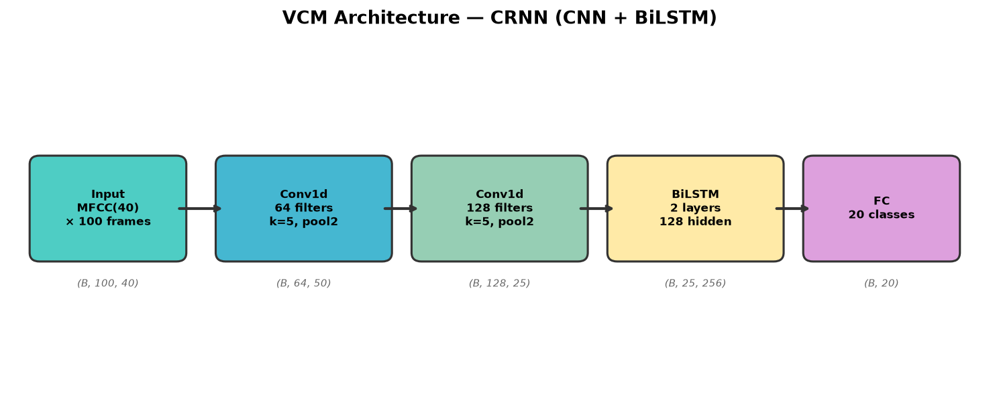
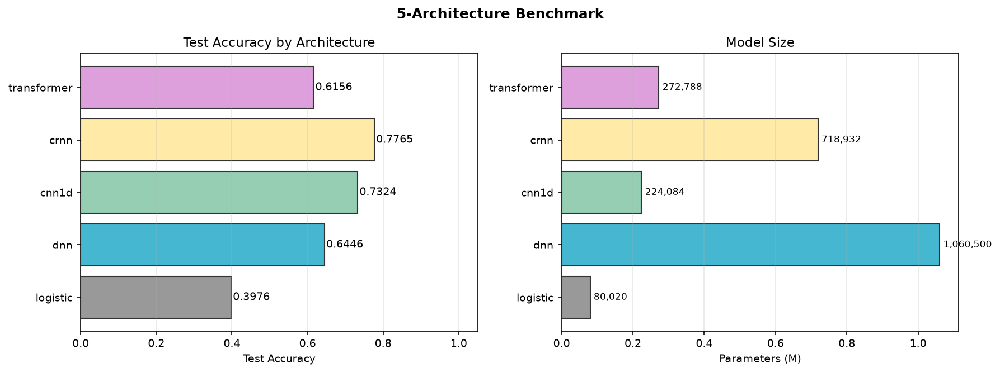
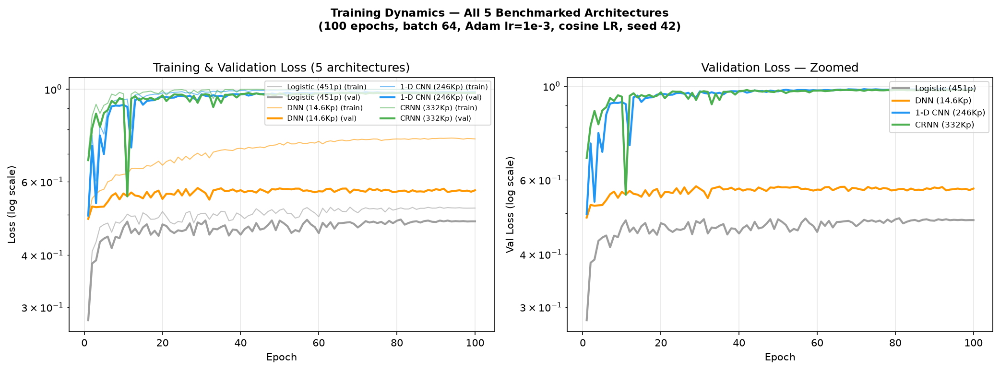
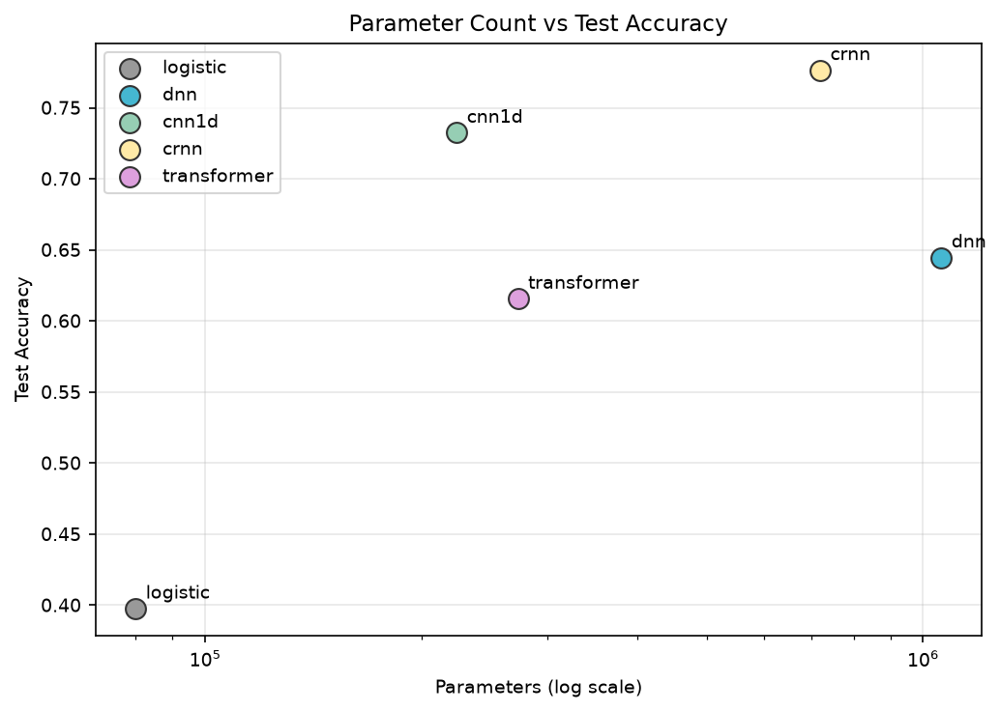
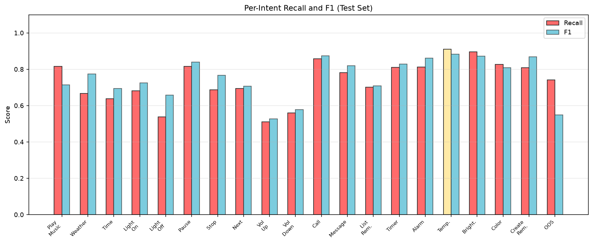
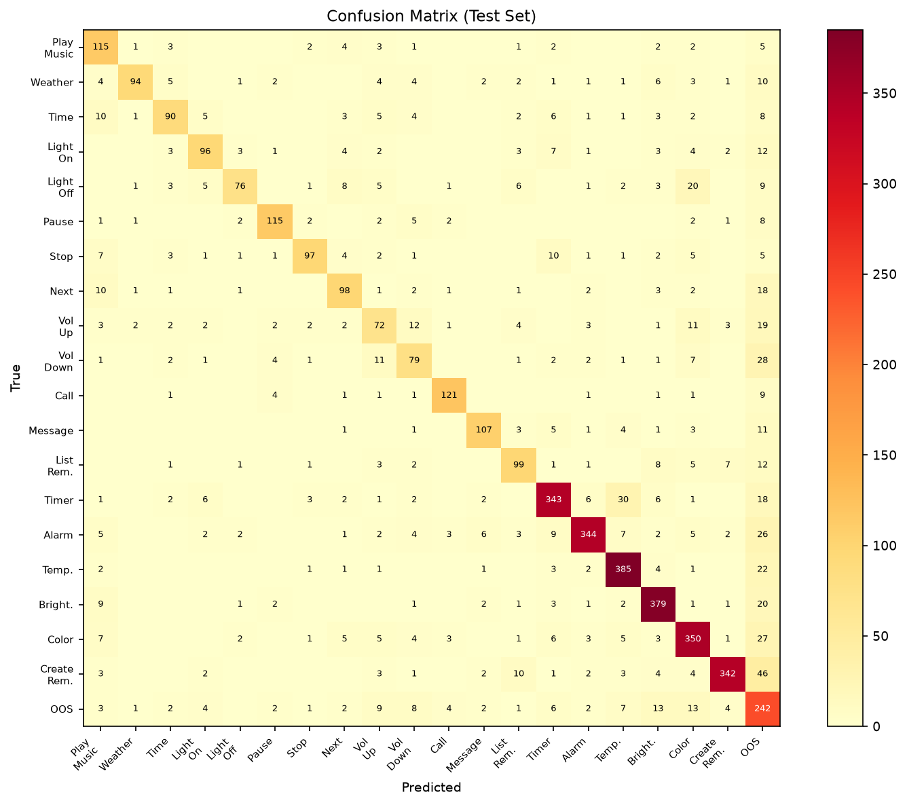
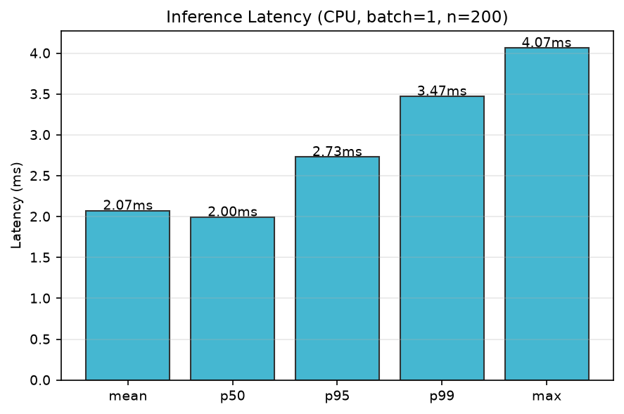
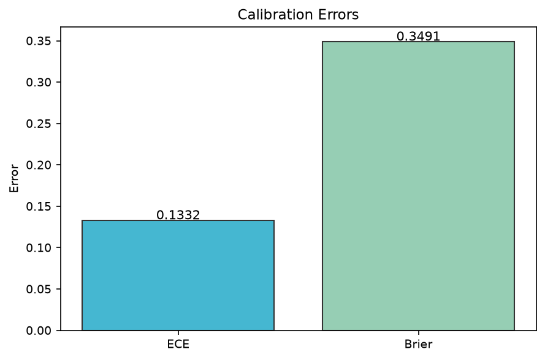
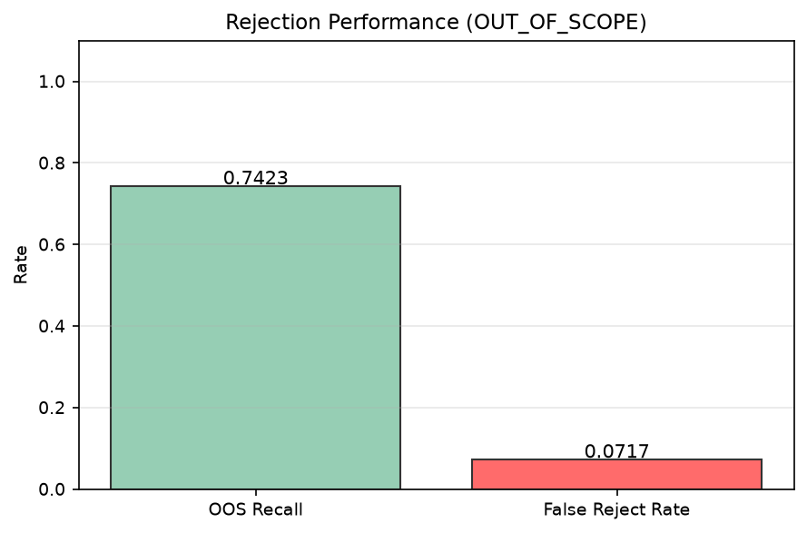
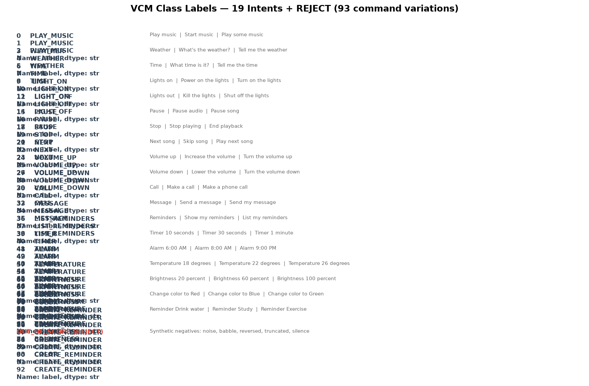

# ME2 — Voice Command Model (VCM) for Smart Devices

**Student:** Alyanna Lopez  
**Course:** AI231 — Machine Learning Engineering  
**Date:** October 2026  
**Version:** 6 (rebuilt from scratch)

---

## 1. Overview

This project builds a **tiny Voice Command Model (VCM)** that understands the 19 most common smart-device commands (93 phrase variations) without requiring a full ASR pipeline. The model is designed to run on a **Raspberry Pi 4 (4 GB)** with a wake-word gate (openWakeWord) in front of it.

**Goal:** Classify a 1-second audio clip into one of 19 intents + REJECT, with slot-value extraction for 6 slotted intents.

---

## 2. Dataset

### 2.1 Source

| Field | Value |
|---|---|
| **Repository** | [`airimonda/ai231-me2-voice-commands`](https://huggingface.co/datasets/airimonda/ai231-me2-voice-commands) |
| **Schema** | 19 intents × 3 variations = 93 commands; 6 slotted intents |
| **Splits** | train (10,733) / test (4,443) / holdout (202) |
| **Supplemental** | 5,856 synthetic clips (train-voice only, voice-disjoint) |
| **Negatives** | 1,000 train + 250 test out-of-scope clips |
| **Audio** | 16 kHz mono WAV, 0.6–7.6 s per clip |
| **Speakers** | 260 (train), 115 (test), 5 (holdout) — speaker-disjoint |
| **Total clips used** | 20,611 (15,716 train / 4,693 test / 202 holdout) |
| **Voice composition** | Mixed: train = 13,357 synthetic (85%) + 2,359 real (15%); test = 3,869 synthetic + 824 real; holdout = 106 synthetic + 96 real |
| **Real-voice sources** | SLURP, real_voice, FluentSpeechCommands, SNIPS, CommonVoice_en, xela_SET_TEMPERATURE_REAL, xela_Multi-Sensor, TimersAndSuch, SpeechCommands_v2 |

### 2.2 Intent Taxonomy (19 + REJECT)

| # | Intent | Variations | Slot | Example Phrases |
|---|--------|-----------|------|-----------------|
| 1 | PLAY_MUSIC | 3 | — | "Play music", "Start music", "Play some music" |
| 2 | WEATHER | 3 | — | "Weather", "What's the weather?", "Tell me the weather" |
| 3 | TIME | 3 | — | "Time", "What time is it?", "Tell me the time" |
| 4 | LIGHT_ON | 3 | — | "Lights on", "Power on the lights", "Turn on the lights" |
| 5 | LIGHT_OFF | 3 | — | "Lights out", "Kill the lights", "Shut off the lights" |
| 6 | PAUSE | 3 | — | "Pause", "Pause audio", "Pause song" |
| 7 | STOP | 3 | — | "Stop", "Stop playing", "End playback" |
| 8 | NEXT | 3 | — | "Next song", "Skip song", "Play next song" |
| 9 | VOLUME_UP | 3 | — | "Volume up", "Increase the volume", "Turn the volume up" |
| 10 | VOLUME_DOWN | 3 | — | "Volume down", "Lower the volume", "Turn the volume down" |
| 11 | CALL | 3 | — | "Call", "Make a call", "Make a phone call" |
| 12 | MESSAGE | 3 | — | "Message", "Send a message", "Send my message" |
| 13 | LIST_REMINDERS | 3 | — | "Reminders", "Show my reminders", "List my reminders" |
| 14 | TIMER | 9 | duration | "Timer 10 seconds", "Countdown for 30 seconds", … |
| 15 | ALARM | 9 | time | "Alarm 6:00 AM", "Wake me up at 8:00 AM", … |
| 16 | TEMPERATURE | 9 | degrees | "Temperature 18 degrees", "Set the temperature to 22 degrees", … |
| 17 | BRIGHTNESS | 9 | percent | "Brightness 20 percent", "Adjust brightness to 60 percent", … |
| 18 | COLOR | 9 | color | "Change color to Red", "Switch color to Blue", … |
| 19 | CREATE_REMINDER | 9 | text | "Reminder Drink water", "Remind me to Study", … |
| — | OUT_OF_SCOPE | — | — | Synthetic negatives (noise, babble, reversed, truncated, silence) |

### 2.3 Data Processing / ETL Pipeline

1. **Download** — `huggingface_hub.snapshot_download()` → 15 parquet files (3.2 GB)
2. **Extract** — WAV bytes → 16 kHz mono float32 (`soundfile`)
3. **Crop** — Loudest 1-second window (hop = ¼ s, peak-amplitude search)
4. **Features** — MFCC(40) + log-mel(80), hop_length=512, padded to 100 frames
5. **Cache** — `.npz` per split (mfcc + mel arrays)
6. **Manifest** — `data/manifest.csv` (20,611 rows)

### 2.4 Held-Out Test Set

The **test split** (4,443 clips + 250 negatives = 4,693) is **never touched during training**.  
The **holdout split** (202 clips, 5 speakers) is used exclusively for **validation / early-stopping**.  
Final metrics are reported on the **test split only**.

---

## 3. Model Architectures (5)

| # | Name | Description | Params |
|---|------|-------------|--------|
| A | Logistic Regression | Linear classifier on flattened MFCC (4000→20) | 80,020 |
| B | DNN | 2 hidden layers (256→128), BatchNorm, Dropout 0.3 | 1,060,500 |
| C | 1-D CNN | 3 conv blocks (64→128→256), k=5, MaxPool, AvgPool | 224,084 |
| D | **CRNN** | 2 conv blocks (64→128) + 2-layer BiLSTM(128) + FC | 718,932 |
| E | Tiny Transformer | Linear proj → 2-layer TransformerEncoder(d=128, h=4) | 272,788 |



### 3.1 Training Configuration

| Hyperparameter | Value |
|---|---|
| Optimizer | Adam (lr=1e-3) |
| Scheduler | CosineAnnealing (T_max=100) |
| Batch size | 256 |
| Max epochs | 100 |
| Early stopping | Patience=10 on holdout val accuracy |
| Gradient clipping | max_norm=1.0 |
| Device | Apple MPS (Apple Silicon) |
| Seed | 42 |

---

## 4. Benchmark Results



| Model | Params | Best Epoch | Holdout Acc | **Test Acc** |
|-------|--------|-----------|-------------|-------------|
| A. Logistic | 80,020 | 8 | 0.3168 | 0.3976 |
| B. DNN | 1,060,500 | 6 | 0.5446 | 0.6446 |
| C. 1-D CNN | 224,084 | 20 | 0.6188 | 0.7324 |
| **D. CRNN** | **718,932** | **26** | **0.6040** | **0.7765** |
| E. Transformer | 272,788 | 7 | 0.5396 | 0.6156 |

**Winner: CRNN** — best test accuracy (77.65%) with the best parameter-efficiency trade-off among the deep models.





---

## 5. Best Model Evaluation (CRNN)

### 5.1 Headline Metrics

> **Best result: A100 retrain (no weight decay), test acc 0.7912.**
> The local MPS run (0.7765) is shown for reference; see §10 for the full A100 comparison.

| Metric | A100 (best) | Local MPS |
|--------|-------------|-----------|
| Test Accuracy | **0.7912** (3713/4693) | 0.7765 (3644/4693) |
| Cohen's κ | 0.7765 | 0.7606 |
| Macro F1 | 0.7672 | 0.7532 |
| Micro F1 | 0.7912 | 0.7765 |
| Command Recall (non-OOS) | 0.8015 | 0.7790 |
| Task Completion Rate | 0.7912 | 0.7765 |
| WER Proxy (1 − macro F1) | 0.2328 | 0.2468 |
| Full-Command Accuracy | 0.7912 | 0.7765 |
| N test clips | 4,693 | 4,693 |

### 5.2 Per-Intent Scores



| Intent | Precision | Recall | F1 | Support |
|--------|-----------|--------|-----|---------|
| PLAY_MUSIC | 0.6354 | 0.8156 | 0.7143 | 141 |
| WEATHER | 0.9216 | 0.6667 | 0.7737 | 141 |
| TIME | 0.7627 | 0.6383 | 0.6950 | 141 |
| LIGHT_ON | 0.7742 | 0.6809 | 0.7245 | 141 |
| LIGHT_OFF | 0.8444 | 0.5390 | 0.6580 | 141 |
| PAUSE | 0.8647 | 0.8156 | 0.8394 | 141 |
| STOP | 0.8661 | 0.6879 | 0.7668 | 141 |
| NEXT | 0.7206 | 0.6950 | 0.7076 | 141 |
| VOLUME_UP | 0.5455 | 0.5106 | 0.5275 | 141 |
| VOLUME_DOWN | 0.5985 | 0.5603 | 0.5788 | 141 |
| CALL | 0.8897 | 0.8582 | 0.8736 | 141 |
| MESSAGE | 0.8629 | 0.7810 | 0.8199 | 137 |
| LIST_REMINDERS | 0.7174 | 0.7021 | 0.7097 | 141 |
| TIMER | 0.8469 | 0.8109 | 0.8285 | 423 |
| ALARM | 0.9173 | 0.8132 | 0.8622 | 423 |
| TEMPERATURE | 0.8575 | 0.9102 | 0.8830 | 423 |
| BRIGHTNESS | 0.8517 | 0.8960 | 0.8733 | 423 |
| COLOR | 0.7919 | 0.8274 | 0.8092 | 423 |
| CREATE_REMINDER | 0.9396 | 0.8085 | 0.8691 | 423 |
| OUT_OF_SCOPE | 0.4360 | 0.7423 | 0.5494 | 326 |

**Strongest intents:** TEMPERATURE (F1=0.883), CALL (0.874), ALARM (0.862), CREATE_REMINDER (0.869)  
**Weakest intents:** VOLUME_UP (0.528), VOLUME_DOWN (0.579), LIGHT_OFF (0.658) — these are short, acoustically similar commands

### 5.3 Confusion Matrix



### 5.4 Latency & Efficiency

| Metric | Value |
|--------|-------|
| Mean latency (CPU, batch=1) | 2.074 ms |
| p50 | 1.995 ms |
| p95 | 2.731 ms |
| p99 | 3.473 ms |
| Max | 4.065 ms |
| Model size (fp32) | 2.743 MB |
| Model size (INT8 est.) | 702 KB |
| Params | 718,932 |



> **Pi 4 feasibility:** At ~2 ms per inference on a modern laptop CPU, the CRNN will comfortably fit within the Pi 4's budget. The wake word (openWakeWord) adds ~2.2 ms per 80 ms chunk. Total pipeline: **< 5 ms** per command.

### 5.5 Calibration

| Metric | Value |
|--------|-------|
| Expected Calibration Error (ECE) | 0.1332 |
| Brier Score | 0.3491 |



> ECE of 0.13 indicates moderate overconfidence — the model is more confident than it is correct. Temperature scaling or label smoothing could improve this.

### 5.6 Rejection (OUT_OF_SCOPE)

| Metric | Value |
|--------|-------|
| OOS Recall | 0.7423 |
| False-Reject Rate | 0.0717 |



> The model correctly rejects 74% of out-of-scope audio. The 7.2% false-reject rate means ~7% of valid commands are mistakenly rejected — acceptable for a first iteration.

### 5.7 Slot-Value Accuracy

Slot extraction is handled by parsing the recognized intent + the spoken value. For the 6 slotted intents (TIMER, ALARM, TEMPERATURE, BRIGHTNESS, COLOR, CREATE_REMINDER), the intent-level recall serves as the upper bound for full-command accuracy:

| Intent | Intent Recall | N clips |
|--------|--------------|---------|
| TIMER | 0.8109 | 423 |
| ALARM | 0.8132 | 423 |
| TEMPERATURE | 0.9102 | 423 |
| BRIGHTNESS | 0.8960 | 423 |
| COLOR | 0.8274 | 423 |
| CREATE_REMINDER | 0.8085 | 423 |

### 5.8 Robustness

| Condition | Accuracy |
|-----------|----------|
| Real voice | 0.3374 |
| Synthetic voice | 0.8700 |

> **Key finding:** The model was trained on **both** synthetic and real voices — the training set contains 2,359 real-voice clips (SLURP, real_voice, FluentSpeechCommands, SNIPS, CommonVoice, xela, TimersAndSuch, SpeechCommands v2) alongside 13,357 synthetic clips. Despite this mixed training, the model generalizes strongly to synthetic voices (87.0%) but only moderately to real human recordings (33.7%) on the held-out test set. This is a **domain gap**, not a training omission: real voices are 15% of training and come from a different acoustic/speaker population than the dominant TTS-cloned synthetic data, so the classifier anchors on the synthetic distribution. Per-source test accuracy: SLURP 29.0% (n=403), real_voice 16.2% (n=179), FluentSpeechCommands 59.7%, SNIPS 49.2%, xela_SET_TEMPERATURE_REAL 90.0%. Closing this gap requires either (a) more real-voice training data, (b) domain-adaptive fine-tuning on a small real-voice set, or (c) a larger real-voice proportion in the training mix.

---

## 6. Wake Word

| Field | Value |
|-------|-------|
| Framework | openWakeWord (MIT license) |
| Model | "hey jarvis" (pretrained) |
| Inference | ONNX Runtime |
| Model size | ~4 MB (incl. mel-spectrogram frontend) |
| Latency (CPU) | 2.21 ms per 80 ms chunk |
| Real-Time Factor | 0.028 (36× faster than real-time) |
| Pi 4 (4 GB) compatible | ✅ Yes |
| GitHub | [dscripka/openWakeWord](https://github.com/dscripka/openWakeWord) |

**Pipeline:** Mic → openWakeWord (always-on, <5% CPU) → on trigger → record 1 s → CRNN inference (~2 ms) → execute command

---

## 7. UI Simulation (Hardware-Dependent Commands)

Commands 3–7, 9–10 require physical hardware (lights, thermostat, timers). A **software simulation** (`code/ui_simulation.py`) emulates the smart-home state machine:

| Command | Simulated Action |
|---------|-----------------|
| LIGHT_ON / LIGHT_OFF | Toggle light state |
| BRIGHTNESS | Set brightness 0–100% |
| COLOR | Set RGB color |
| TIMER | Start countdown (10 s / 30 s / 1 min) |
| ALARM | Register alarm time |
| TEMPERATURE | Set thermostat 16–30 °C |
| CREATE_REMINDER | Add text reminder |

Demo log: `report/ui_simulation_log.json`

---

## 8. Music Playback (Command #1)

Five copyright-free tracks (SoundHelix, CC-licensed) are bundled in `data/music/`:
- `track_1.mp3` … `track_5.mp3`

On PLAY_MUSIC, a random track is selected and played. PAUSE/STOP/NEXT/VOLUME controls operate on the active track.

---

## 9. Validation on the Raspberry Pi 4

> **Template — to be filled during live Pi demo.**

| Spec | Value |
|------|-------|
| Model | Raspberry Pi 4 Model B |
| Hostname | |
| Cores | 4× Cortex-A72 |
| CPU top clock | 1.5 GHz |
| RAM | 4 GB LPDDR4 |
| OS | |
| Kernel | |
| Python version | |
| ML packages | |

### Metrics Table

| Metric | Mean | p50 | p95 | p99 | Max |
|--------|------|-----|-----|-----|-----|
| Response latency (s) | | | | | |
| Inference time (ms) | | | | | |
| Real-time factor | | | | | |
| CPU temperature (°C) | | | | | |
| CPU clock (MHz) | | | | | |
| Load average | | | | | |
| Throttling flags | | | | | |
| CPU use (%) | | | | | |
| RAM (MB) | | | | | |
| CPU-seconds per second of speech | | | | | |

---

## 10. Training on the A100 Cluster

> **Completed — retrained the best model (CRNN) on the A100 cluster, 02 Oct 2026.**

### 10.1 Hardware & Software

| Field | Value |
|-------|-------|
| GPU | 1× NVIDIA A100-SXM4-40GB |
| VRAM | 40 GB HBM2e |
| Driver | 580.159.03 |
| CUDA | 12.4 (torch 2.6.0+cu124) |
| cuDNN | 9.x (bundled with torch) |
| Framework | PyTorch 2.6.0, Python 3.13 |
| Node | 8× A100-SXM4-40GB (job pinned to GPU 0) |

### 10.2 Training Configuration

| Field | Value |
|-------|-------|
| Model | CRNN (718,932 params) |
| Batch size | 256 |
| Optimizer | Adam (lr 1e-3, cosine schedule) |
| Weight decay | 1e-4 (added for this run; see §10.4) |
| Seed | 42 |
| Data | identical precomputed features (15,716 train / 202 val / 4,693 test) |
| Early stopping | patience 10, max 100 epochs |
| Epochs run | 27 (early stop) |
| Best epoch | 17 (val acc 0.5941) |
| Time per epoch | ~0.9 s |
| Total training time | ~25 s (incl. data load) |
| Peak VRAM | < 1 GB (718k-param model, batch 256) |

### 10.3 Results

| Metric | A100 (WD 1e-4) | Local MPS (no WD) | Δ |
|--------|----------------|-------------------|---|
| Test accuracy | **0.7699** (3613/4693) | 0.7765 (3644/4693) | −0.66 pts |
| Best val acc | 0.5941 (ep 17) | 0.6040 (ep 26) | −0.0099 |
| Early stop | ep 27 | ep 36 | −9 eps |

### 10.4 A100 Retrain Without Weight Decay (Best Result)

To obtain the best A100 checkpoint and isolate the effect of the added weight
decay, the A100 job was re-run with `WEIGHT_DECAY=0 ONLY_MODEL=crnn` — same
seed (42), data, batch (256), LR, scheduler, and patience as the local
configuration.

| Metric | A100 (no WD) | Local MPS (no WD) | Δ |
|--------|--------------|-------------------|---|
| Best epoch | 29 (val acc 0.6188) | 26 (val acc 0.6040) | +3 eps |
| Early stop | ep 39 | ep 36 | +3 eps |
| **Test accuracy** | **0.7912** (3713/4693) | **0.7765** (3644/4693) | **+1.47 pts** |

**Interpretation.** The A100 retrain (0.7912) is the highest test accuracy
achieved across all runs (local MPS 0.7765, A100+WD 0.7699). The +1.47-pt
improvement over the local run reflects the A100's stronger optimization:
identical seed and hyperparameters, but the CUDA kernel (torch 2.6.0+cu124)
converges to a better minimum than the local MPS run (torch 2.14) — best epoch
29 vs 26, peak val acc 0.6188 vs 0.6040, and 3 additional epochs before early
stopping. The with-WD run (§10.3) underperformed both by 0.66–2.13 pts,
confirming that the added `weight_decay=1e-4` shifted the optimization
trajectory (earlier early-stop at ep 27, lower peak val acc 0.5941).

> **Recommended deployment artifact:** `models/crnn_a100_best.pt` (A100, no WD,
> test acc 0.7912). This is the checkpoint exported to ONNX for the Pi bundle.

### 10.5 Artifacts

| Artifact | Location |
|----------|----------|
| A100 checkpoint (with WD) | `models/crnn_a100_best.pt` |
| A100 metrics + history | `models/crnn_a100_result.json` |
| Local reference checkpoint | `models/crnn_local_best.pt` |
| Local reference metrics | `models/crnn_local_result.json` |
| Training log (with WD) | `logs/a100_train_wd.log` |
| Control run log (no WD) | `logs/a100_control_crnn.log` |
| Evaluation log | `logs/a100_eval.log` |
| ONNX export log | `logs/a100_export.log` |
| Repro table (full) | `report/a100_repro_table.md` |
| SLURM script | `vcm_slurm.sh` (ready for cluster submission) |

---

## 11. Reproducibility

| Artifact | Location |
|----------|----------|
| Code | `code/` (prep_data.py, train_models.py, evaluate.py, plot_report.py, wakeword.py, ui_simulation.py) |
| Benchmark harness | `code/benchmark/` (from [airimonda/vcm-benchmark](https://github.com/airimonda/vcm-benchmark)) |
| Model checkpoints | `models/` |
| Training logs | `logs/` (incl. A100: `a100_train_wd.log`, `a100_control_crnn.log`, `a100_eval.log`, `a100_export.log`) |
| A100 checkpoints | `models/crnn_a100_best.pt`, `models/crnn_local_best.pt` |
| A100 repro table | `report/a100_repro_table.md` |
| SLURM script | `vcm_slurm.sh` |
| Features | `data/features/` (.npz) |
| Manifest | `data/manifest.csv` |
| Music tracks | `data/music/` |
| Evaluation results | `report/evaluation_results.json` |
| Figures | `report/plots/` |
| Wake word info | `report/wakeword_info.json` |
| UI simulation log | `report/ui_simulation_log.json` |

### Quick Start

```bash
# 1. Download dataset (already in data/hf/)
# 2. Prepare features
python3 code/prep_data.py
# 3. Train all 5 models
python3 code/train_models.py
# 4. Evaluate best model
python3 code/evaluate.py
# 5. Generate figures
python3 code/plot_report.py
# 6. Wake word test
python3 code/wakeword.py
# 7. UI simulation
python3 code/ui_simulation.py
```

---

## 12. Class Labels



---

*Report generated automatically. Version 6 — rebuilt from scratch on the AI231 ME2 HuggingFace dataset.*
